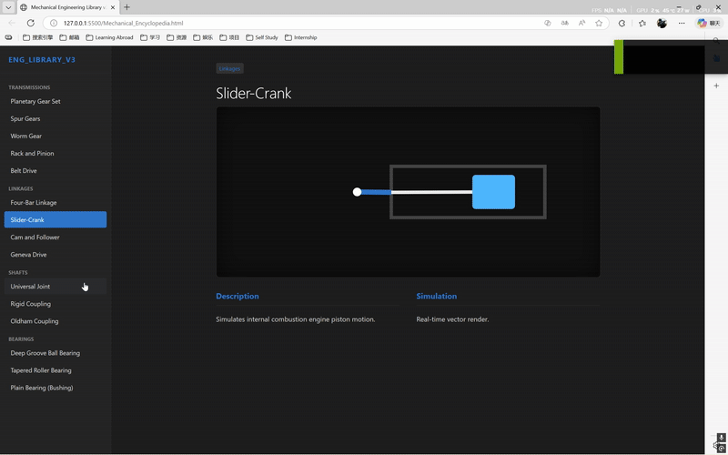

# Mechanical Engineering Encyclopedia

An interactive, web-based visualization library demonstrating core mechanical engineering principles through real-time vector animations.


## 🚀 Overview

This project provides a lightweight, educational tool for visualizing how various mechanical systems work. It features precise SVG-based animations of transmissions, linkages, couplings, and bearings, simulating their kinematic behavior directly in the browser without the need for heavy engines or plugins.

### ✨ Visual Examples

<p align="center">
  
  
  
</p>

## 🛠 Features

The library covers four main categories of mechanical systems:

### 1. Transmissions & Gears
*   **Planetary Gear Set:** Visualizes differential rotation between Sun, Planet Carrier, and Ring gear.
*   **Spur Gears:** Demonstrates basic counter-rotation and precise tooth meshing.
*   **Worm Gear:** Shows high reduction ratios and self-locking worm drive mechanics with synchronized threading.
*   **Rack and Pinion:** Illustrates the conversion of rotational motion to linear motion with mathematically accurate pitch.
*   **Belt Drive:** Simulates both open and crossed belt configurations.

### 2. Linkages & Mechanisms
*   **Four-Bar Linkage:** The fundamental Crank-Rocker mechanism demonstrating complex output paths.
*   **Slider-Crank:** Simulates the reciprocating piston motion found in internal combustion engines.
*   **Cam and Follower:** Visualizes how a rotating profile controls the rise and fall of a follower.
*   **Geneva Drive:** Demonstrates intermittent rotary motion (converting continuous rotation to stepped motion).

### 3. Shafts & Couplings
*   **Universal Joint:** Shows power transmission between shafts at varying angles.
*   **Oldham Coupling:** Demonstrates how to compensate for parallel shaft misalignment.
*   **Rigid Coupling:** Visualizes a solid, bolted connection between perfectly aligned shafts.

### 4. Bearings
*   **Deep Groove Ball Bearing:** Rolling element friction reduction.
*   **Tapered Roller Bearing:** Visualizes structures capable of handling both radial and axial loads.
*   **Plain Bearing (Bushing):** Illustrates the oil film lubrication principle.

## 💻 Technical Details

*   **Zero Dependencies:** Built entirely with vanilla HTML, CSS, and JavaScript.
*   **Vector Graphics:** Uses SVG for crisp, scalable, and lightweight rendering at any zoom level.
*   **Real-time Kinematics:** Movements are calculated on the fly using JavaScript logic (trigonometry and physics approximations) rather than pre-rendered video.
*   **Single File:** The entire application is contained within `Mechanical_Encyclopedia.html` for easy portability.

## 📦 How to Use

1.  **Download:** Clone the repository or simply download the `Mechanical_Encyclopedia.html` file.
    ```bash
    git clone https://github.com/jason0925pig-rgb/mechanical-encyclopedia.git
    ```
2.  **Run:** Double-click `Mechanical_Encyclopedia.html` to open it in your default web browser (Chrome, Firefox, Edge, Safari).
3.  **Interact:** Use the sidebar menu to switch between different mechanisms.

## 🤝 Contributing

Contributions are welcome! If you'd like to improve the physics engines, add new mechanisms, or refine the visuals:

1.  Fork the Project
2.  Create your Feature Branch (`git checkout -b feature/AmazingMechanism`)
3.  Commit your Changes (`git commit -m 'Add some AmazingMechanism'`)
4.  Push to the Branch (`git push origin feature/AmazingMechanism`)
5.  Open a Pull Request

## 📄 License

Distributed under the MIT License. See `LICENSE` for more information.
